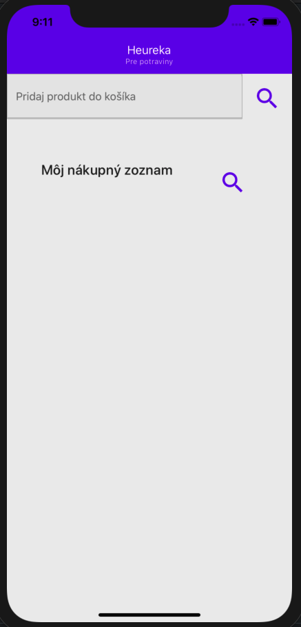

# *Heureka pre potraviny* - mobile application

## Prerequisites
1. Create an [Expo account](Expo.io)
2. Install `node_modules`
```sh
npm i
```
or
```sh
yarn i
```
3. (Optional and recommended) Install required [Android dependencies](https://docs.expo.io/versions/v37.0.0/workflow/android-studio-emulator/)
4. (Optional) Install required [iOS dependencies](https://docs.expo.io/versions/v37.0.0/workflow/ios-simulator/)

## Start the project
```sh
yarn start
```
or
```sh
npm start
```
It should automatically starts the debugger in a browser window.

The you will see a set of options in the terminal.


First press `s` and sign with your account.

If you successfully sign in you should see more options. Or press `?`.


You have few options to start your project
- `w` - it will open the UI in your default browser (might be a new feature, since last time I used React native)
- `a` - it should start the application in the Android device.
  - You can choose either physical device connected with USB. You need to enable developer mode and USB debugging.
  - You can choose Android emulator. Before you choose the this options. Make sure you have installed [Android tools](https://docs.expo.io/versions/v37.0.0/workflow/android-studio-emulator/#step-2-set-up-a-virtual-device) and your *Android virtual device (AVD)* is running. Otherwise you will get an error, because it is not able to start your emulator automatically.

First initialization will take quite a while and you should see a loading indicator in your emulator and the terminal.


After this step is complete, you will see the app window.



Then every change should be visible in few seconds, because of hot reloading.

*Working with Android device is sometimes buggy. Working with iOS is easier (e.g. autostart of the emulator)*. See [Solving common problems](#solving-common-problems) section.

## First changes
Just open [Main file](./App.js). Do your changes, save them, wait for the hot reload and profit in your device.

## Material UI
The basic project uses Material UI library for `react-native` called [`react-native-paper`](https://callstack.github.io/react-native-paper/index.html). An example implementation is contained in [Counter.js file](Counter.js).


## Testing
We use [`react-native-testing-library`](https://github.com/callstack/react-native-testing-library).

See an [example](./tests/App.test.jsx);

## Solving common problems
### Downloading JavaScript bundle is at 100% for a while
It might happened that the installation froze. Then you need to close the application in the emulator, close it from task manager and rerun from the terminal with `a`.
If it does not help you can restart the bundler with `shift-r`. Or quit the `yarn start` and start from beginning.

### I do not see my changes
- Check the error message in the debugging window
- Hot reload might got frozen. Apply [restarting option](#downloading-javascript-bundle-is-at-100-for-a-while)

## Additional information
See [`package.json`](package.json)
